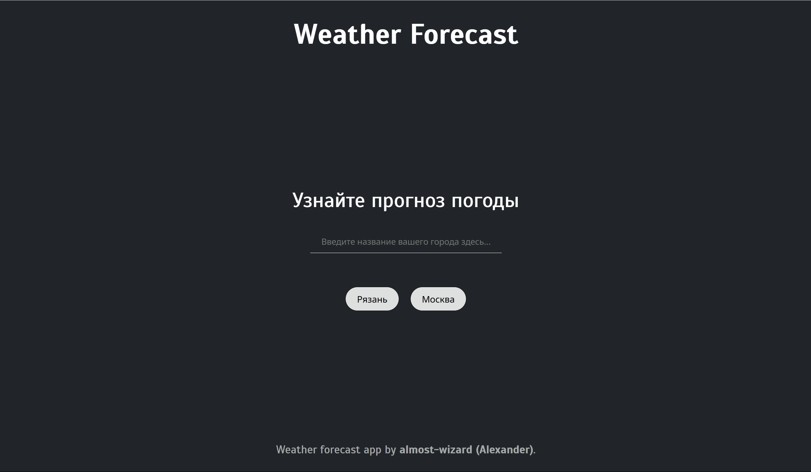
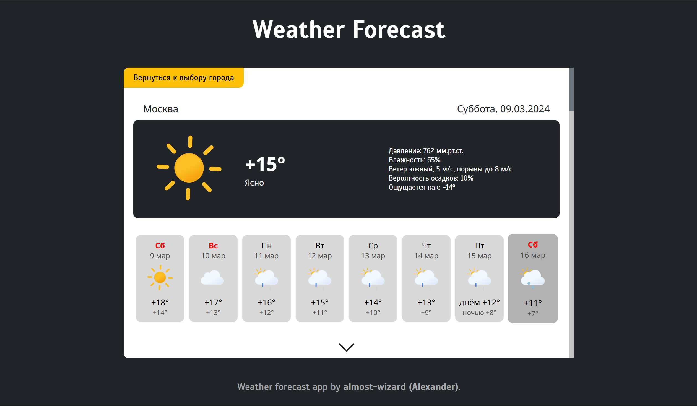
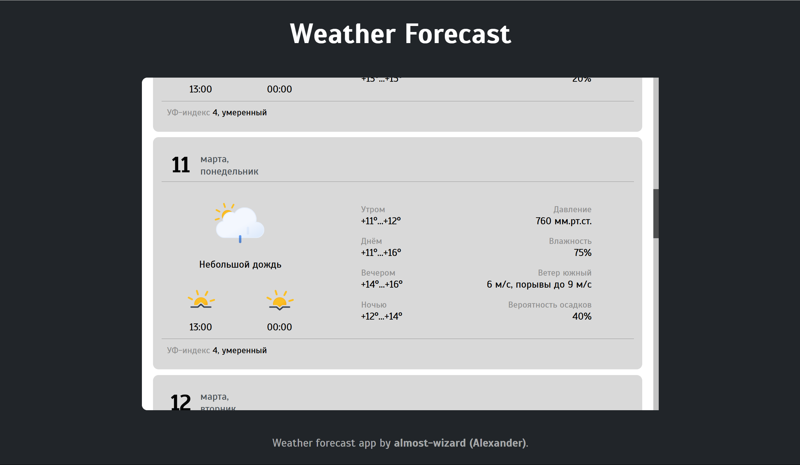
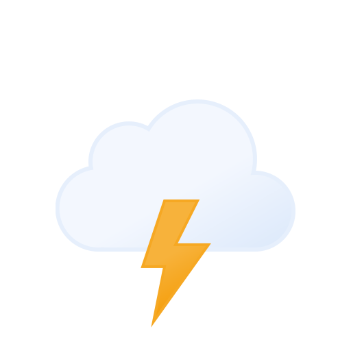

# Weather Forecast

<div align="center">
  
</div>

## Описание

Weather Forecast - это современное веб-приложение для просмотра прогноза погоды, разработанное на React. Приложение предоставляет детальную информацию о текущей погоде и прогноз на 7 дней, включая температуру, влажность, ветер, вероятность осадков и другие метеорологические параметры.

## Особенности

- 🌡️ Детальный прогноз погоды на 7 дней
- 📍 Поиск по городам
- 🌤️ Красивые иконки погоды
- 📊 Подробная информация о температуре, влажности, ветре
- 🌅 Время восхода и заката
- 🌈 УФ-индекс
- 🔄 Автоматическое обновление данных
- 📱 Адаптивный дизайн
- 🛡️ Fallback на моковые данные при проблемах с API

## Галерея

### Скриншоты




### Анимированные иконки погоды
<div align="center">
  <h4>Дневные иконки</h4>
  
  
  
  
  
  
  
  
  

  <h4>Ночные иконки</h4>
  
  
  
  

  <h4>Время суток</h4>
  
  
</div>

## Установка

1. Убедитесь, что у вас установлен Node.js 14 или выше
2. Клонируйте репозиторий:
```bash
git clone https://github.com/almost-wizard/weather-forecast.git
cd weather-forecast
```

3. Установите зависимости:
```bash
npm install
```

## Запуск

Для разработки:
```bash
npm start
```

Для продакшена:
```bash
npm run build
```

## Использование

1. Введите название города в поисковую строку
2. Выберите нужный город из выпадающего списка
3. Просматривайте детальный прогноз погоды
4. Используйте кнопку "Вернуться к выбору города" для нового поиска

## Системные требования

- Node.js 14+
- Современный веб-браузер
- Подключение к интернету

## Структура проекта

```
weather-forecast/
├── public/            # Статические файлы
├── src/               # Исходный код
│   ├── API/           # Работа с API
│   ├── components/    # Компоненты
│   ├── mock/          # Замоканные данные
│   └── utils/         # Вспомогательные функции
├── webpack.config.js  # Конфигурация сборки
└── package.json       # Зависимости проекта
```

## Технологии

- React
- Webpack
- Axios
- OpenWeatherMap API

---

⭐ Не забудьте поставить звезду репозиторию, если вам понравился проект!
